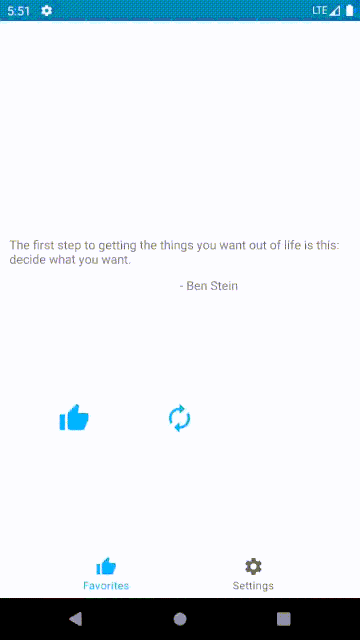

# Simply Quotes
My take on making my old Quote App into MVVM architecture with some more "advance" additions.
I tried recreating my old application whilst learning new topics. Along the way I got a deeper understanding of various UI components, lifecycles, architecture components, good practices and so on. It was a fun journey that is nearing it's end. 

Opening the app for the first time
-------------
First time users get Balloons helping them get a grasp of the app (see Acknowledgments). This only runs once when a user enters the app for the first time. Every screen has it's own "first time" check so that if a user leaves app before entering a new screen for the first time, it will still show him helpful Balloons on that screen! 

Main app screen
--------------

General idea is simplicity. No ads being displayed every 5 seconds, no distractions, just simply, quotes. Once ran and the quotes are loaded then you can use the app fully offline thanks to Rooms Local Database. From this screen, quotes can be saved for later use.

Favorite quotes
--------------

In the favorite quotes screen you are able to copy, delete and view your saved quotes! Swipe to delete, click to save, trash can to delete everything. Simplicity throughout. 

Future Plans
--------------
Some of the features that will be added are accessibility, localization, more quotes and generally more things to do. Main aspects of accessibility will be Text To Speech, better optimization and support for the visually impaired users. Other changes will include eye candy visual changes, mostly to the settings screen and the animations.

Libraries Used
--------------
[Taken From - Google Sunflower Example][99] 

* [Foundation][0] - Components for core system capabilities, Kotlin extensions and support for
  multidex and automated testing.
  * [AppCompat][1] - Degrade gracefully on older versions of Android.
  * [Android KTX][2] - Write more concise, idiomatic Kotlin code.
  * [Test][4] - An Android testing framework for unit and runtime UI tests.
* [Architecture][10] - A collection of libraries that help you design robust, testable, and
  maintainable apps. Start with classes for managing your UI component lifecycle and handling data
  persistence.
  * [Data Binding][11] - Declaratively bind observable data to UI elements.
  * [Dagger-2][100] - For Dependancy Injection and connecting app modules.
  * [Lifecycles][12] - Create a UI that automatically responds to lifecycle events.
  * [LiveData][13] - Build data objects that notify views when the underlying database changes.
  * [Navigation][14] - Handle everything needed for in-app navigation.
  * [Room][16] - Access your app's SQLite database with in-app objects and compile-time checks.
  * [ViewModel][17] - Store UI-related data that isn't destroyed on app rotations. Easily schedule
     asynchronous tasks for optimal execution.
* [UI][30] - Details on why and how to use UI Components in your apps - together or separate
  * [Animations & Transitions][31] - Move widgets and transition between screens.
  * [Fragment][34] - A basic unit of composable UI.
  * [Layout][35] - Lay out widgets using different algorithms.
* Third party
  * [Kotlin Coroutines][91] for managing background threads with simplified code and reducing needs for callbacks

[0]: https://developer.android.com/jetpack/components
[1]: https://developer.android.com/topic/libraries/support-library/packages#v7-appcompat
[2]: https://developer.android.com/kotlin/ktx
[4]: https://developer.android.com/training/testing/
[10]: https://developer.android.com/jetpack/arch/
[11]: https://developer.android.com/topic/libraries/data-binding/
[12]: https://developer.android.com/topic/libraries/architecture/lifecycl
[13]: https://developer.android.com/topic/libraries/architecture/livedata
[14]: https://developer.android.com/topic/libraries/architecture/navigation/
[16]: https://developer.android.com/topic/libraries/architecture/room
[17]: https://developer.android.com/topic/libraries/architecture/viewmodel
[18]: https://developer.android.com/topic/libraries/architecture/workmanager
[30]: https://developer.android.com/guide/topics/ui
[31]: https://developer.android.com/training/animation/
[34]: https://developer.android.com/guide/components/fragments
[35]: https://developer.android.com/guide/topics/ui/declaring-layout
[91]: https://kotlinlang.org/docs/reference/coroutines-overview.html
[99]: https://github.com/android/sunflower
[100]: https://github.com/google/dagger

## Acknowledgments

https://github.com/skydoves/Balloon For displaying the first time users with helpful Balloons
